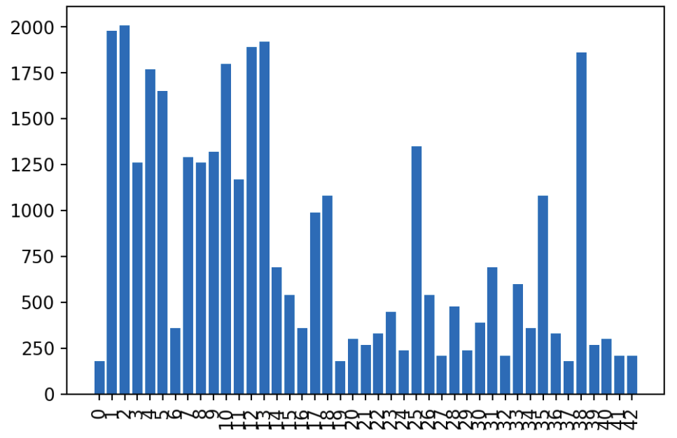
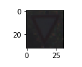
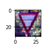
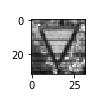
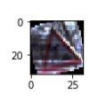
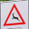
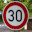
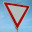

## Traffic Sign Recognition

### - The goals / steps of this project are the following:
* Load the data set (see below for links to the project data set)
* Explore, summarize and visualize the data set
* Design, train and test a model architecture
* Use the model to make predictions on new images
* Analyze the softmax probabilities of the new images
* Summarize the results with a written report

### Data Set Summary & Exploration

I used the numpy library to calculate summary statistics of the traffic
signs data set:

* The size of training set is 34799
* The size of the validation set is 4410
* The size of test set is 12630
* The shape of a traffic sign image is (32, 32, 3)
* The number of unique classes/labels in the data set is 43

#### Exploratory visualization of the dataset.

Here is an exploratory visualization of the data set. It is a bar chart showing the number of images per sign type



### Design and Test a Model Architecture

As a first step, I decided to normalize the images because in many cases the light was different and the color saturation low. with the normalization the images get better visualization and at the end better performance in the training process

Here is an example of a traffic sign image before and after normalizing.




As a last step, I decided to convert the images to grayscale because the neural network get better performance and accuracy with the images in grayscale. 

Here is an example of a traffic sign image before and after grayscaling.




I decided to generate additional data because I wanted to get a better accuracy in the training 

To add more data to the the data set, I used the rotation technique because some signs like the roundabout use to be in a different angle  

Here is an example of a rotated image:




#### Final model architecture
My final model consisted of the following layers:

| Layer         		|     Description	        					| 
|:---------------------:|:---------------------------------------------:| 
| Input         		| 32x32x3 RGB image   							| 
| Convolution 5x5     	| 1x1 stride, valid padding, outputs 28x28x18 	|
| RELU					|												|
| Max pooling	      	| 2x2 stride,  outputs 14x14x18 				|
| Convolution 5x5	    | 1x1 stride, valid padding, outputs 10x10x46	|
| RELU					|												|
| Max pooling	      	| 2x2 stride,  outputs 5x5x46    				|
| Fully connected		| Input = 1150. Output = 300  					|
| RELU					|												|
| Fully connected		| Input = 300. Output = 215  					|
| RELU					|												|
| Fully connected		| Input = 215. Output = 43	        			|	


#### 3. Training the model. 

To train the model, I used the softmax_cross_entropy_with_logits() tensorflow's function and AdamOptimizer() to optimize the model

The hyperparameters that I used are: 

```python
EPOCHS = 40
BATCH_SIZE = 170
rate = 0.0007
```

#### 4. Describing the approach taken

I use the same architecture of LeNet, the only thing that I did was to adjust the different layer's size to fit the input and the output required.

My final model results were:
* validation set accuracy of 97,1% 
* test set accuracy of 94,9%

### Testing a Model on New Images

Here are five German traffic signs that I found on the web:

 

 
 


The second image might be difficult to classify because the arrows are in a different position.

#### Predictions on these new traffic signs

Here are the results of the prediction:

| Image			        |     Prediction	        					| 
|:---------------------:|:---------------------------------------------:| 
| Wild animals crossing | Wild animals crossing							| 
| Roundabout  			| priority road									|
| Speed limit (30km/h)	| Speed limit (30km/h)							|
| Stop  	      		| Stop      					 				|
| Yield	        		| Yield       	        						|


The model was able to correctly guess 4 of the 5 traffic signs, which gives an accuracy of 80%.

#### The top 5 softmax probabilities for each image.

For the first image

| Probability         	|     Prediction	        					| 
|:---------------------:|:---------------------------------------------:| 
| 1         			| Wild animals crossing	                    	| 
| 6.00177518e-26		| Double curve									|
| 1.68250970e-30		| Slippery road									|
| 2.20521532e-37		| Bicycles crossing	    		 				|
| 0.00000000e+00	    | Speed limit (20km/h)							|


For the second image

| Probability         	|     Prediction	        					| 
|:---------------------:|:---------------------------------------------:| 
| 0.84       			| Priority road                             	| 
| 0.09          		| Speed limit (80km/h)  						|
| 0.05          		| Keep right                  					|
| 0.0003           		| No vehicles                    				|
| 0.0002	            | Speed limit (50km/h)                     		|


For the third image

| Probability         	|     Prediction	        					| 
|:---------------------:|:---------------------------------------------:| 
| 1       			    | Speed limit (30km/h)                         	| 
| 2.93516500e-14     	| Speed limit (50km/h)  						|
| 3.50822567e-25    	| Speed limit (80km/h)      					|
| 5.99364385e-29  		| Speed limit (20km/h)  		 				|
| 4.37693572e-30        | End of speed limit (80km/h)           		|


For the fourth image

| Probability         	|     Prediction	        					| 
|:---------------------:|:---------------------------------------------:| 
| 1         			| Stop                                         	| 
| 1.57495494e-09		| Speed limit (50km/h)      					|
| 1.25616184e-09		| Speed limit (80km/h)   						|
| 1.40248285e-10		| Speed limit (70km/h)   		 				|
| 8.84531476e-11	    | Keep left             						|


For the fifth image

| Probability         	|     Prediction	        					| 
|:---------------------:|:---------------------------------------------:| 
| 1         			| Yield                                         | 
| 0.00000000e+00	    | Speed limit (20km/h)							|
| 0.00000000e+00	    | Speed limit (30km/h)							|
| 0.00000000e+00	    | Speed limit (50km/h)							|
| 0.00000000e+00	    | Speed limit (60km/h)							|
